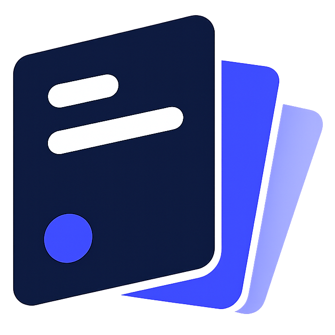

<div align="center">
  

  <h1>LocalDeck</h1>

  <p><strong>Kanban. Local. Secure. Private.</strong></p>

  <p>
    A local-first, privacy-respecting Kanban and project management app inspired by Trello,
    built to be lightweight, offline-capable, fast, and fully user-controlled.
  </p>
</div>

<div align="center">

[](LICENSE)
[](package.json)
[](https://github.com/CafecitoExpress95/LocalDeck/releases)
[](#desktop-support)

</div>

> LocalDeck is designed for people who want the clarity of a visual board without handing their projects, notes, and planning data to a hosted service.

## Table of Contents

- [About LocalDeck](#about-localdeck)
- [Feature Highlights](#feature-highlights)
- [Screenshots](#screenshots)
- [Installation](#installation)
- [Philosophy](#philosophy)
- [Contribution Policy](#contribution-policy)
- [Security](#security)
- [Roadmap](#roadmap)
- [Building from Source](#building-from-source)
- [License](#license)

## About LocalDeck

LocalDeck is a local-first Kanban application for organizing boards, lists, cards, checklists, templates, custom fields, and project notes without requiring an account or cloud backend.

The project is intentionally built around a few clear principles:

| Principle | What it means |
| --- | --- |
| Local-first | Your boards are stored locally using IndexedDB and Dexie.js. |
| No accounts | You do not need a login to create, edit, or use a board. |
| No subscriptions | LocalDeck is open source software, not a hosted SaaS plan. |
| No telemetry | The app is not designed around usage tracking or analytics collection. |
| No cloud lock-in | Project data is intended to remain user-controlled and portable. |
| Offline capable | Core workflows are available without an internet connection. |
| Fast and lightweight | SvelteKit, TailwindCSS, and Tauri keep the app responsive and compact. |
| Open source | The code is available for inspection, learning, and personal modification. |

## Feature Highlights

### Boards

Create focused project spaces for personal planning, software work, writing, research, or lightweight team workflows. Boards are designed to be quick to open, easy to scan, and simple to manage.

### Lists

Organize work into flexible Kanban lists such as `Backlog`, `In Progress`, `Review`, and `Done`. Lists can be reordered as the shape of a project changes.

### Cards

Cards hold the details of the work: titles, descriptions, comments, labels, checklists, structured values, and project context. Markdown rendering is supported for richer card notes.

### Checklists

Add named checklists to cards, organize checklist items into nested parent and child outlines, reorder checklist work in place, and track progress from the board while keeping the data local and portable.

### Templates

Create reusable card structures for repeated workflows. Templates help keep recurring work consistent without turning the app into a heavyweight process tool.

### Custom Fields

Add structured information to cards for project-specific tracking. Use custom fields for status details, metadata, estimates, references, or any lightweight planning system that fits your work.

### Local Storage

LocalDeck stores board data locally through IndexedDB, with Dexie.js providing a reliable browser database layer. The goal is simple: your planning data should stay on your machine by default.

### Board Archives

Export and import board archives for backup, transfer, and long-term ownership. Archive validation helps keep imported board data predictable and safe.

### Themes

LocalDeck is built with TailwindCSS and includes theming support as part of the user experience. Additional themes are planned as the design system matures.

### Desktop Support

LocalDeck targets desktop builds through Tauri 2.

| Platform | Target |
| --- | --- |
| macOS | Apple Silicon and Intel |
| Linux | x64 |
| Windows | x64 |
| Web | Static deployment compatible |

### Future Plans

The project roadmap includes stable release channels, nightly builds, a hosted GitHub Pages demo, Docker support, Android exploration, optional encryption, and more themes.

## Screenshots

<!--
Add real screenshots when they are available.
Suggested location: docs/screenshots/
Do not use generated or mock screenshots for the public release README.
-->

| Area | Preview | Caption |
| --- | --- | --- |
| Board view | `docs/screenshots/board-view.png` | Main Kanban board with lists and cards. |
| Card details | `docs/screenshots/card-details.png` | Card editor with notes, fields, and comments. |
| Templates | `docs/screenshots/templates.png` | Template workflow for reusable card structures. |
| Themes | `docs/screenshots/themes.png` | Theme selection and visual customization. |

> Screenshot placeholders are intentionally listed as paths until real application screenshots are committed.

## Installation

### Windows

1. Open the [GitHub Releases](https://github.com/CafecitoExpress95/LocalDeck/releases) page.
2. Download the latest Windows x64 installer from the release assets.
3. Run the installer and follow the prompts.
4. Launch LocalDeck from the Start menu or desktop shortcut.

> Release asset names may vary until the first stable public release is finalized.

### GitHub Releases

The recommended installation path for desktop builds is the GitHub Releases page. Each release is expected to include versioned desktop artifacts when available.

| Channel | Purpose |
| --- | --- |
| Stable | Tested builds intended for regular use. |
| Nightly | Faster iteration builds for previewing upcoming changes. |
| Source archive | Repository snapshot for users who want to inspect or build manually. |

### GitHub Pages Demo

A static GitHub Pages demo is planned. Because LocalDeck is local-first, the web demo is intended to run in the browser using local storage rather than a hosted backend.

### macOS and Linux

macOS and Linux desktop release notes will be added as packaged builds become available. Planned targets include macOS Apple Silicon, macOS Intel, and Linux x64.

### Docker

Docker support is planned for users who want a containerized static web deployment path. LocalDeck does not require Docker for normal desktop usage.

## Philosophy

LocalDeck exists because many planning tools are more complicated, network-dependent, or account-centered than they need to be.

This project values:

- Local ownership of data over platform lock-in.
- Minimalism over feature sprawl.
- Reliability over constant reinvention.
- Simple workflows over configuration-heavy systems.
- Privacy by default, without telemetry or a cloud backend.
- Open source transparency, so users can inspect how the app works.

The goal is not to clone every feature of Trello or replace every project management suite. The goal is to provide a focused, dependable board application that feels good to use and respects the person using it.

## Contribution Policy

LocalDeck is open source, and forking is encouraged. You are welcome to study the code, adapt it for personal use, and build your own experiments from it under the terms of the project license.

At this stage, pull requests are currently disabled. LocalDeck is a personal project, and the maintainer is intentionally keeping direct code contributions closed while the application architecture, release process, and long-term direction settle.

Bug reports, security reports, reproduction notes, and thoughtful feedback are welcome. The project benefits from careful users even when direct code contributions are not open yet.

| Contribution type | Current status |
| --- | --- |
| Forking | Encouraged |
| Bug reports | Welcome |
| Security reports | Welcome privately |
| Feature ideas | Welcome for consideration |
| Pull requests | Currently disabled |
| Direct maintainer-approved code contributions | Closed for now |

Thank you for respecting the current boundary while the project matures.

## Security

Security concerns should be reported privately to the maintainer rather than opened as public issues.

LocalDeck is designed as a local-first application:

- No cloud backend is required for core use.
- No account system is required.
- No telemetry is built into the project goals.
- Project data is intended to remain local and user-controlled.

Local-first software still needs careful handling, especially around imports, archives, local files, and desktop packaging. Responsible reports are appreciated.

## Roadmap

| Area | Status |
| --- | --- |
| Stable releases | Planned |
| Nightly builds | Planned |
| GitHub Pages demo | Planned |
| Docker support | Planned |
| Android support | Planned |
| Encryption support | Planned |
| Additional themes | Planned |

Roadmap items are directional and may change as the project evolves.

## Building from Source

> These commands are for contributors and advanced users building their own local copy.

### Requirements

- Node.js `20` or newer is recommended.
- npm is used by the current project scripts.
- Rust and the Tauri prerequisites are required for native desktop builds.
- Platform-specific build tools may be required by Tauri.

### Install dependencies

```sh
npm install
```

### Run the web app locally

```sh
npm run dev
```

### Validate the project

```sh
npm run check
npm run build
npm run test
```

### Build the Tauri desktop app

```sh
npm run tauri build
```

### Useful scripts

| Command | Description |
| --- | --- |
| `npm run check` | Runs SvelteKit sync and Svelte type checking. |
| `npm run build` | Builds the static SvelteKit app. |
| `npm run lint` | Runs Prettier checks and ESLint. |
| `npm run test` | Runs the Vitest test suite once. |
| `npm run tauri build` | Builds the desktop application with Tauri. |

## License

LocalDeck is open source software licensed under the [GNU General Public License v3.0](LICENSE).

You are free to inspect, study, fork, and modify the project under the terms of that license.

---

<div align="center">
  

  <p><strong>Kanban. Local. Secure. Private.</strong></p>

  <p>Created and maintained by <a href="https://github.com/CafecitoExpress95">@CafecitoExpress95</a>.</p>
</div>
